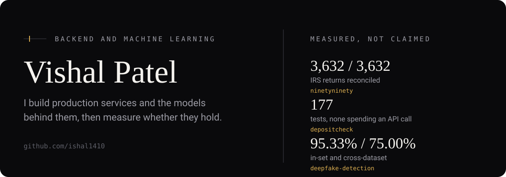
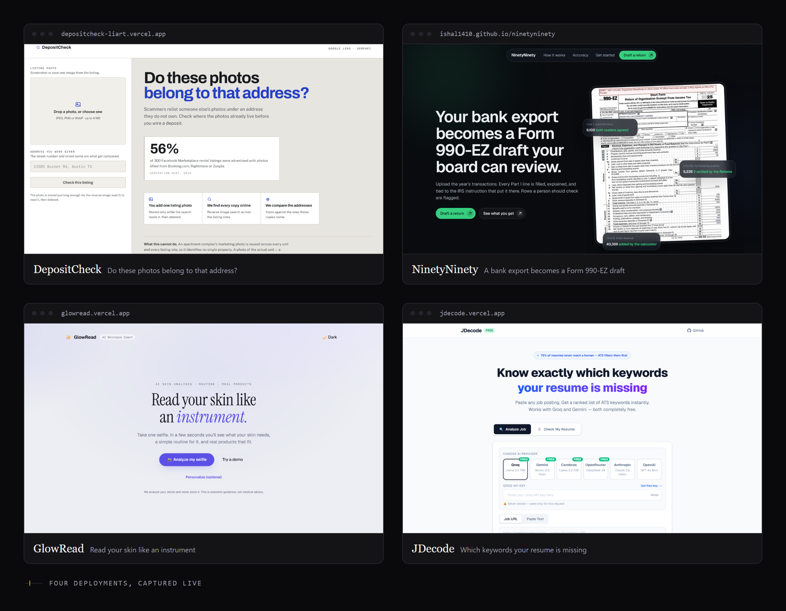
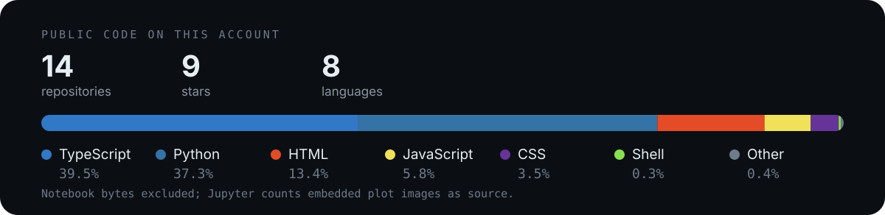

  
  
  

I build backend services and the machine learning systems behind them, from the API layer down to the infrastructure they run on. Most of what is here began as a question I could not answer by reading, so I built the thing and measured it.

  <a href="https://depositcheck-liart.vercel.app">depositcheck</a> ·
  <a href="https://ishal1410.github.io/ninetyninety/">ninetyninety</a> ·
  <a href="https://glowread.vercel.app">glowread</a> ·
  <a href="https://jdecode.vercel.app">jdecode</a>

### [depositcheck](https://github.com/ishal1410/depositcheck) · [live](https://depositcheck-liart.vercel.app)

**Winner, SerpApi "Best AI Use Case" — DevNetwork API+Cloud+AI Hackathon 2026**
`Next.js` `TypeScript` `SerpApi google_lens` `177 tests`

Upload one photo from a rental listing, type the address you were given, and find out whether those photos already belong to a different property. Rental scams work by theft rather than invention, and the photos are the part the scammer cannot change.

The design decision worth reading is that there is no green "safe" verdict. A listing built from AI-generated photos returns zero reverse-image matches, which is the same signal as an honest landlord who photographed the flat themselves. An accusation therefore requires positive evidence, a competing street address actually found and named by two independent sites, because on its first real production request the tool accused a real landlord off a truncated API response. That rule is written down in [ADR-0001](https://github.com/ishal1410/depositcheck/blob/master/docs/adr/0001-accuse-only-on-positive-evidence.md) and the truncated response is checked in as a regression fixture.

### [ninetyninety](https://github.com/ishal1410/ninetyninety) · [live](https://ishal1410.github.io/ninetyninety/)

`Python` `Strands Agents` `Gemini` `Streamlit`

A volunteer treasurer's bank export becomes a drafted IRS Form 990-EZ, with every line citing the transactions behind it and the rule that put them there. Two agents classify each row without seeing each other's reasoning, and a referee runs only where they disagree, so disagreements surface on screen instead of being resolved silently.

The arithmetic that fills the form was checked against 3,632 real Form 990-EZ returns from the IRS e-file corpus by rebuilding each return's stated totals from its own line items: 3,632 of 3,632 on total revenue, 99.97% on total expenses. The three mismatches are two real filings whose own totals disagree with their own components, listed in [`results/validation.json`](https://github.com/ishal1410/ninetyninety/blob/master/results/validation.json). Python computes every total; the model never adds.

### Open source

Two pull requests open against [datahub-project/datahub](https://github.com/datahub-project/datahub): a [Vite alias resolution fix](https://github.com/datahub-project/datahub/pull/19336) for builds run from outside the project root, and [column descriptions on hover](https://github.com/datahub-project/datahub/pull/19359) in the lineage graph.

### [glowread](https://github.com/ishal1410/glowread) · [glowread.vercel.app](https://glowread.vercel.app)

`Next.js 16` `React 19` `TypeScript` `Perfect Corp API` `Vitest`

Selfie in, scores across 11 skin concerns and a matched AM/PM routine out. The planner is deterministic code and the LLM only rewrites wording, so the output schema cannot break and 120 Vitest tests cover the planning logic directly.

### [jdecode](https://github.com/ishal1410/jdecode) · [jdecode.vercel.app](https://jdecode.vercel.app)

`Next.js 16` `FastAPI` `Python` `PyMuPDF`

Paste a job posting, get the keywords your resume is missing ranked from critical down to nice to have. It runs on your own key across six providers, four of them free, and the key is passed per request and never stored, so hosting it costs nothing.

### [ml-serving-platform](https://github.com/ishal1410/ml-serving-platform)

`FastAPI` `PyTorch` `AWS S3` `Docker` `Terraform` `Prometheus` `Grafana`

EfficientNet-B0 served behind FastAPI, with model weights pulled from S3 at runtime rather than baked into the image, so the container stays small and the model can be swapped without a rebuild. Terraform provisions the AWS side and the compose stack brings up Prometheus and Grafana alongside the API.

### [realtime-chat-app](https://github.com/ishal1410/realtime-chat-app)

`Node.js` `TypeScript` `Apollo Server v5` `GraphQL` `Redis` `Kafka` `PostgreSQL` `Kubernetes` `CI`

WebSockets for delivery, GraphQL for history. Redis Pub/Sub fans messages across instances so any server can reach a client connected to any other, and Kafka carries async events to decoupled consumers. Auth is JWT with bcryptjs, DataLoader batches the resolvers, and the repo ships GitHub Actions CI alongside Kubernetes manifests for the app, Postgres, and Redis.

### [deepfake-detection-faceforensics](https://github.com/ishal1410/deepfake-detection-faceforensics)

`TensorFlow` `EfficientNet-B0` `MTCNN` `dlib` `Grad-CAM`

EfficientNet-B0 with spatial attention reached 89.33% at 0.9611 AUC on FaceForensics++, and the best ensemble reached 95.33%. Tested cross-dataset on Celeb-DF v2 it falls to 75.00%, which says more about how well it generalizes than the headline figure does.

### [neural-decoding-bci](https://github.com/ishal1410/neural-decoding-bci)

`Python` `Ridge Regression` `scikit-learn`

Which failure mode actually breaks a brain-computer interface: electrodes dying, or the neural signal drifting over months? On 256-electrode intracortical recordings from an ALS patient (Card et al., NEJM 2024), drift is by far the more damaging of the two.

### [catalogpilot](https://github.com/ishal1410/catalogpilot)

`Python` `Google ADK` `Gemini` `DataHub`

Ask a data catalog a question in plain English, get an answer traced through real lineage and ownership with every asset named by its URN. The agent holds one write tool out of the twelve DataHub exposes, because catalog text is untrusted input reaching a model that has write access.

### [linkedin-job-scanner](https://github.com/ishal1410/linkedin-job-scanner)

`JavaScript` `Node.js` `CI` · zero dependencies · 

Pulls fresh job postings into a spreadsheet from the same public listings a logged-out visitor sees. Most tools in this space want your session cookie, which is exactly the automation LinkedIn restricts accounts for.

<b>Other projects</b>

 

| Project | Stack | What it does |
|---|---|---|
| [weather-forecast-project](https://github.com/ishal1410/weather-forecast-project) | LSTM · ARIMA · Streamlit | Ensemble weather forecasting dashboard, best RMSE 2.61°C |
| [slippage-impact-model](https://github.com/ishal1410/slippage-impact-model) | Python · NumPy · SciPy | Nonlinear market impact from live order book data, with Lagrange-optimized trade scheduling |
| [music-recommender](https://github.com/ishal1410/music-recommender) | Python · Flask | Collaborative filtering over a user similarity graph, walked to surface unheard tracks |

  <a href="mailto:vp1412003@gmail.com">vp1412003@gmail.com</a> · <a href="https://www.linkedin.com/in/vishal1410">linkedin.com/in/vishal1410</a>

